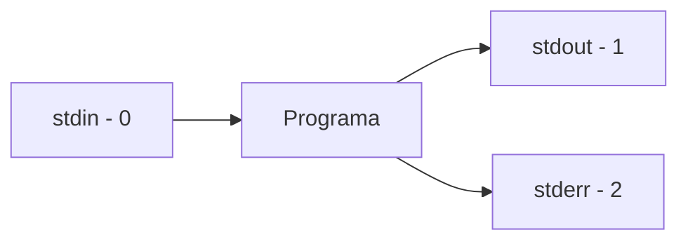

# Entrada y Salida (I/O)


En Unix, todo programa tiene tres canales de comunicación: **entrada estándar (stdin)**, **salida estándar (stdout)** y **error estándar (stderr)**. Entender esto te da poder sobre cómo fluyen los datos.

---

## Los Tres Flujos Estándar

Cada programa que ejecutas tiene tres "tubos" conectados:



| Flujo | Número | Descripción | Por defecto |
|-------|--------|-------------|-------------|
| stdin | 0 | Entrada - de dónde lee | Teclado |
| stdout | 1 | Salida normal | Pantalla |
| stderr | 2 | Errores y advertencias | Pantalla |

---

## stdout vs stderr - ¿Por qué dos salidas?

Imagina que un programa es una persona hablando:

```
┌─────────────────────────────────────────────────────────────┐
│                        PROGRAMA                              │
│                                                              │
│  Resultados normales ──────► stdout (canal 1) ──► Pantalla  │
│  "Aquí está lo que pediste"                                  │
│                                                              │
│  Errores/advertencias ─────► stderr (canal 2) ──► Pantalla  │
│  "Algo salió mal"                                            │
└─────────────────────────────────────────────────────────────┘
```

### ¿Qué es stdout? (Standard Output)

**stdout** es el canal para **resultados normales** - lo que el programa *quiere* decirte:

```bash
ls /tmp
# archivo1.txt
# archivo2.txt
# └── Esto es stdout: la lista de archivos que pediste
```

### ¿Qué es stderr? (Standard Error)

**stderr** es el canal para **errores y advertencias** - cuando algo sale mal:

```bash
ls /directorio_que_no_existe
# ls: cannot access '/directorio_que_no_existe': No such file or directory
# └── Esto es stderr: un mensaje de error
```

### El problema: ambos aparecen igual en pantalla

Por defecto, stdout y stderr se mezclan en tu pantalla:

```bash
# Este comando produce AMBOS
ls /tmp /directorio_falso

# En tu pantalla ves todo mezclado:
# archivo1.txt          ← stdout (resultado de /tmp)
# archivo2.txt          ← stdout
# ls: cannot access...  ← stderr (error del directorio falso)
```

**¿Cómo saber cuál es cuál?** No puedes distinguirlos visualmente. Pero puedes separarlos con redirección (lo veremos abajo).

### ¿Por qué separar stdout y stderr?

Esta separación te permite:

| Situación | Lo que puedes hacer |
|-----------|---------------------|
| Guardar resultados | Redirigir stdout a archivo, errores siguen en pantalla |
| Ver solo errores | Descartar stdout, mantener stderr |
| Logs separados | Guardar resultados en un archivo, errores en otro |
| Scripts robustos | Procesar resultados sin que errores contaminen |

**Ejemplo práctico:**

```bash
# Quieres guardar la lista de archivos, pero ver errores en pantalla
ls /home /noexiste > lista.txt
# Los archivos de /home van al archivo
# El error de /noexiste aparece en tu pantalla (stderr no se redirigió)
```

:::exercise{title="Experimentar con stdout y stderr" difficulty="1"}

```bash
# 1. Comando que solo produce stdout
echo "Esto va a stdout"

# 2. Forzar un mensaje a stderr (usando >&2)
echo "Esto va a stderr" >&2

# 3. Comando que produce ambos
ls /home /directorio_inventado
# Observa: ¿puedes distinguir cuál línea es stdout y cuál stderr?

# 4. Ahora sepáralos
ls /home /directorio_inventado > solo_stdout.txt
# ¿Qué apareció en pantalla? (stderr)
# ¿Qué hay en el archivo? (stdout)
cat solo_stdout.txt
```

:::

---

## Redirección de Salida

### `>` - Redirigir stdout a archivo (sobrescribe)

```bash
# Guardar salida en archivo
echo "Hola mundo" > salida.txt
cat salida.txt
# Hola mundo

# ¡CUIDADO! Sobrescribe el contenido
echo "Nueva línea" > salida.txt
cat salida.txt
# Nueva línea (lo anterior se perdió)
```

### `>>` - Redirigir stdout a archivo (agrega)

```bash
# Agregar al final del archivo
echo "Línea 1" > archivo.txt
echo "Línea 2" >> archivo.txt
echo "Línea 3" >> archivo.txt

cat archivo.txt
# Línea 1
# Línea 2
# Línea 3
```

:::exercise{title="Practicar redirección básica" difficulty="1"}

```bash
# 1. Crea un archivo con >
echo "Primera línea" > mi_archivo.txt

# 2. Agrega líneas con >>
echo "Segunda línea" >> mi_archivo.txt
echo "Tercera línea" >> mi_archivo.txt

# 3. Ver contenido
cat mi_archivo.txt

# 4. Guardar la lista de tu home
ls -la ~ > lista_home.txt
cat lista_home.txt

# 5. Limpia
rm mi_archivo.txt lista_home.txt
```

:::

### `2>` - Redirigir stderr

```bash
# Redirigir solo los errores
ls /tmp /directorio_falso 2> errores.txt

# La lista de /tmp aparece en pantalla
# El error se guarda en errores.txt
cat errores.txt
# ls: cannot access '/directorio_falso': No such file or directory
```

### `2>&1` - Combinar stderr con stdout

```bash
# Redirigir ambos al mismo lugar
ls /tmp /directorio_falso > todo.txt 2>&1

# O la forma moderna (Bash 4+)
ls /tmp /directorio_falso &> todo.txt

cat todo.txt
# Contiene tanto la lista como el error
```

### `/dev/null` - El agujero negro

Para descartar output que no necesitas:

```bash
# Descartar stdout (solo ver errores)
ls /tmp > /dev/null
# (sin output)

# Descartar stderr (solo ver salida normal)
ls /tmp /directorio_falso 2> /dev/null
# Solo muestra la lista de /tmp

# Descartar TODO
ls /tmp /directorio_falso &> /dev/null
# Sin ningún output
```

:::exercise{title="Separar stdout y stderr" difficulty="2"}

```bash
# Crea un comando que genere ambos
ls /home /directorio_inventado

# Ahora sepáralos en archivos diferentes
ls /home /directorio_inventado > salida.txt 2> errores.txt

# Verifica
echo "=== SALIDA ==="
cat salida.txt
echo "=== ERRORES ==="
cat errores.txt

# Limpia
rm salida.txt errores.txt
```

:::

---

## Redirección de Entrada

### `<` - Leer desde archivo

```bash
# Crear archivo de entrada
echo "Hola" > entrada.txt
echo "Mundo" >> entrada.txt

# Leer con <
cat < entrada.txt
# Hola
# Mundo

# Contar palabras desde archivo
wc -w < entrada.txt
# 2
```

### Here Documents (`<<EOF`)

Un **here document** permite incluir múltiples líneas de texto directamente en un comando, sin crear un archivo separado.

#### Sintaxis

```
comando << DELIMITADOR
línea 1
línea 2
línea 3
DELIMITADOR
```

```
cat << EOF > archivo.txt
 │   │    │
 │   │    └── (opcional) también redirigir a archivo
 │   └── DELIMITADOR - marca el inicio (puede ser cualquier palabra)
 └── << indica "lo que sigue es un here document"
```

- **`<<`** = "toma las siguientes líneas como entrada"
- **`DELIMITADOR`** = una palabra que marca inicio y fin (comúnmente `EOF`, pero puede ser cualquiera)
- Todo el texto entre los delimitadores se envía como stdin al comando

#### Ejemplo básico

```bash
cat << EOF
Hola mundo
Esta es la segunda línea
Adiós
EOF
```

Output:
```
Hola mundo
Esta es la segunda línea
Adiós
```

#### Combinando con redirección `>`

```bash
# Crear un archivo con múltiples líneas
cat << EOF > mi_documento.txt
Primera línea del archivo.
Segunda línea.
Tercera línea.
EOF

cat mi_documento.txt
# Muestra las tres líneas
```

---

#### `<< EOF` vs `<< 'EOF'` - MUY IMPORTANTE

| Sintaxis | Variables | Comandos `$()` | Usar para |
|----------|-----------|----------------|-----------|
| `<< EOF` | Se expanden | Se ejecutan | Contenido dinámico |
| `<< 'EOF'` | NO se expanden | NO se ejecutan | Contenido literal |

##### Sin comillas: `<< EOF` (variables se expanden)

```bash
nombre="Juan"

cat << EOF
Hola $nombre
Tu home es $HOME
Fecha: $(date)
EOF
```

Output:
```
Hola Juan
Tu home es /home/juan
Fecha: Mon Jan 27 10:30:00 CST 2026
```

##### Con comillas: `<< 'EOF'` (todo es literal)

```bash
nombre="Juan"

cat << 'EOF'
Hola $nombre
Tu home es $HOME
Fecha: $(date)
EOF
```

Output:
```
Hola $nombre
Tu home es $HOME
Fecha: $(date)
```

**¿Cuándo usar `<< 'EOF'`?**

- Cuando escribes **código** que contiene `$` (scripts, configuraciones)
- Cuando quieres el texto **exactamente como está escrito**

```bash
# Crear un script - necesitas 'EOF' para que $1 no se expanda
cat << 'EOF' > mi_script.sh
#!/bin/bash
echo "Argumento: $1"
EOF
```

---

#### Delimitadores comunes

Puedes usar cualquier palabra como delimitador:

```bash
cat << TEXTO
contenido aquí
TEXTO

cat << FIN_ARCHIVO
contenido aquí
FIN_ARCHIVO

cat << SCRIPT
contenido aquí
SCRIPT
```

`EOF` (End Of File) es solo una convención popular.

:::exercise{title="Practicar here documents" difficulty="2"}

```bash
# 1. Here document básico
cat << EOF
Línea uno
Línea dos
EOF

# 2. Con variables (se expanden)
usuario=$USER
cat << EOF
Usuario actual: $usuario
Home: $HOME
EOF

# 3. Sin expansión (literal)
cat << 'EOF'
Este $signo no se expande
Ni este $(comando)
EOF

# 4. Crear un archivo de configuración
cat << EOF > config.txt
# Config generada el $(date)
user=$USER
home=$HOME
EOF
cat config.txt

# 5. Crear un script (necesita 'EOF')
cat << 'EOF' > saludo.sh
#!/bin/bash
echo "Hola, $1!"
EOF
chmod +x saludo.sh
./saludo.sh Mundo

# Limpia
rm config.txt saludo.sh
```

:::

---

## El Comando `read` - Leer Entrada del Usuario

`read` lee una línea de stdin y la guarda en una variable:

```bash
# Pedir input al usuario
echo "¿Cómo te llamas?"
read nombre
echo "Hola, $nombre"
```

### Opciones útiles de `read`


```bash
# -p: Prompt en la misma línea
read -p "Tu nombre: " nombre
echo "Hola, $nombre"

# -s: Silencioso (para contraseñas)
read -s -p "Contraseña: " password
echo ""  # Nueva línea después
echo "Contraseña guardada (${#password} caracteres)"

# -t: Timeout en segundos
read -t 5 -p "Tienes 5 segundos: " respuesta

# -n: Leer N caracteres
read -n 1 -p "Presiona una tecla: " tecla
echo ""
echo "Presionaste: $tecla"
```


:::exercise{title="Interactuar con read" difficulty="2"}

```bash
# Programa interactivo simple
echo "=== ENCUESTA ==="

read -p "Tu nombre: " nombre
read -p "Tu edad: " edad
read -p "Tu lenguaje favorito: " lenguaje

echo ""
echo "=== RESULTADOS ==="
echo "$nombre tiene $edad años y le gusta $lenguaje"
```

:::

:::exercise{title="Calculadora interactiva" difficulty="2"}

```bash
# Pedir dos números
read -p "Primer número: " a
read -p "Segundo número: " b

# Mostrar operaciones
echo "Resultados:"
echo "$a + $b = $((a + b))"
echo "$a - $b = $((a - b))"
echo "$a * $b = $((a * b))"
echo "$a / $b = $((a / b))"
```

:::

---

## Pipes y I/O

Los pipes (`|`) conectan stdout de un comando con stdin del siguiente:

```bash
# stdout de ls -> stdin de grep
ls -la | grep ".txt"

# stdout de cat -> stdin de wc
cat archivo.txt | wc -l
```

```mermaid
graph LR
    A[ls -la] -->|stdout| B[pipe]
    B -->|stdin| C[grep ".txt"]
    C -->|stdout| D[pantalla]
```

:::exercise{title="Cadena de pipes" difficulty="2"}

```bash
# Cuenta cuántos archivos .md hay en /home
ls -la /home | wc -l

# Lista procesos y busca bash
ps aux | grep bash

# Combina varios comandos
cat /etc/passwd | cut -d: -f1 | sort | head -10
# ¿Qué hace cada parte?
```

:::

---

## Tabla Resumen de Redirección

| Operador | Descripción | Ejemplo |
|----------|-------------|---------|
| `>` | stdout a archivo (sobrescribe) | `ls > lista.txt` |
| `>>` | stdout a archivo (agrega) | `echo "más" >> lista.txt` |
| `2>` | stderr a archivo | `cmd 2> errores.txt` |
| `2>>` | stderr a archivo (agrega) | `cmd 2>> errores.txt` |
| `&>` | stdout + stderr a archivo | `cmd &> todo.txt` |
| `2>&1` | stderr a donde va stdout | `cmd > log.txt 2>&1` |
| `<` | stdin desde archivo | `wc < archivo.txt` |
| `<<EOF` | Here document | `cat << EOF ... EOF` |
| `\|` | Pipe (stdout a stdin) | `ls \| grep txt` |
| `/dev/null` | Descartar | `cmd > /dev/null` |

---

## Ejercicios Integrales

:::exercise{title="Crear log de sistema" difficulty="2"}

```bash
# Crea un archivo de log
echo "=== LOG INICIADO $(date) ===" > sistema.log

# Agrega información
echo "Usuario: $USER" >> sistema.log
echo "Home: $HOME" >> sistema.log
echo "Shell: $SHELL" >> sistema.log
echo "Directorio actual: $PWD" >> sistema.log

# Lista de procesos (solo cuenta)
echo "Procesos corriendo: $(ps aux | wc -l)" >> sistema.log

# Espacio en disco
echo "=== DISCO ===" >> sistema.log
df -h >> sistema.log 2>&1

echo "=== LOG TERMINADO ===" >> sistema.log

# Ver resultado
cat sistema.log
```

:::

:::exercise{title="Filtrar errores" difficulty="3"}

```bash
# Comando que genera errores y salida
ls /home /etc /noexiste /tmp /tampoco

# Guarda solo la salida exitosa
ls /home /etc /noexiste /tmp /tampoco 2> /dev/null > exitoso.txt

# Guarda solo los errores
ls /home /etc /noexiste /tmp /tampoco > /dev/null 2> fallido.txt

# Verifica
echo "Exitosos:"
cat exitoso.txt
echo "Errores:"
cat fallido.txt
```

:::

:::exercise{title="Menú interactivo" difficulty="3"}

```bash
echo "=== MENÚ ==="
echo "1. Ver fecha"
echo "2. Ver usuario"
echo "3. Ver directorio"
echo "4. Salir"
echo ""
read -p "Elige opción (1-4): " opcion

# Responder según opción
case $opcion in
    1) date ;;
    2) echo "Usuario: $USER" ;;
    3) pwd ;;
    4) echo "Adiós" ;;
    *) echo "Opción no válida" ;;
esac
```

:::

---

## Resumen

| Concepto | Descripción |
|----------|-------------|
| stdin (0) | Entrada estándar (teclado) |
| stdout (1) | Salida estándar (pantalla) |
| stderr (2) | Errores estándar (pantalla) |
| `>` | Redirigir stdout a archivo |
| `>>` | Agregar stdout a archivo |
| `2>` | Redirigir stderr |
| `&>` | Redirigir ambos |
| `<` | Leer stdin desde archivo |
| `read` | Leer input del usuario |
| `<<EOF` | Here document |

---

> **Siguiente:** Ahora veremos **expansión y sustitución** - el verdadero poder del símbolo `$`.
